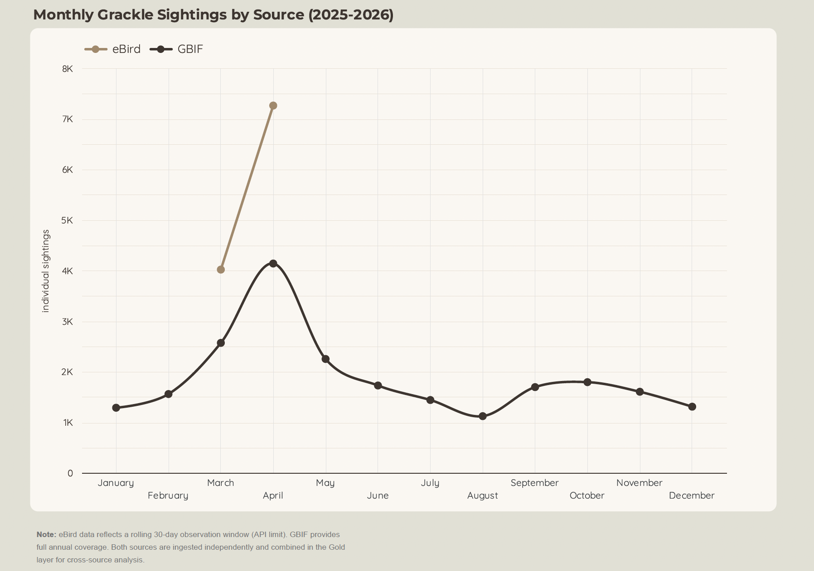
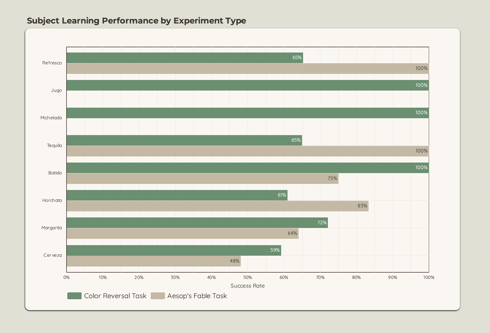

# Grackle Watch

End-to-end data engineering pipeline analyzing Great-tailed Grackle (*Quiscalus mexicanus*) sightings and behavioral experiments across the United States.

**DataTalks.Club Data Engineering Capstone 2026 | Author: Victoria Torreno**

---

## Dashboard

[View Live Dashboard](https://datastudio.google.com/s/spKRTuhL728)

---

## Problem Description

The Great-tailed Grackle (*Quiscalus mexicanus*) is one of North America's fastest-expanding bird species, yet its behavioral flexibility remains understudied at scale. This project builds an end-to-end data pipeline integrating three independent data sources to analyze both the geographic spread of grackle sightings and the cognitive performance of individual subjects in controlled behavioral experiments.

This pipeline answers:
- Where and when are Great-tailed Grackles most active across the United States?
- How do sighting patterns shift seasonally across GBIF and eBird sources?
- Do individual grackles show measurable learning curves across tool use and color discrimination tasks?
- Do grackles exhibit consistent spatial bias in approach direction during foraging trials?

---

## Architecture

┌─────────────────────────────────────────────────────────────────────┐
│                         Grackle Watch Pipeline                      │
└─────────────────────────────────────────────────────────────────────┘

  SOURCES              BRONZE              SILVER              GOLD
  ───────              ──────              ──────              ────
  GBIF API  ──┐
              │
  eBird API ──┼── dlt ──── GCS ──── Spark ──── GCS ──── dbt ──── BigQuery
              │
  KNB CSVs  ──┘

                    ┌─────────────────────────────────┐
                    │  Kestra (Orchestration)         │
                    │  Terraform (Infrastructure)     │
                    │  Docker (Containerization)      │
                    └─────────────────────────────────┘

                                                            │
                                                      Looker Studio

---

## Tech Stack

| Layer               | Tool                      | Description                                                    |
| :-------------------| :-------------------------| :------------------------------------------------------------- |
| **Cloud**           | **Google Cloud Platform** | Primary cloud infrastructure and resource hosting.             |
| **Infrastructure**  | **Terraform**             | IaC for reproducible GCS buckets and BigQuery datasets.        |
| **Containerization**| **Docker**                | Reproducible environments for Kestra and Spark jobs.           |
| **Orchestration**   | **Kestra**                | Pipeline scheduling and workflow management via Docker Compose.|
| **Environment**     | **uv**                    | Python package management for high-performance ingestion.      |
| **Ingestion**       | **dlt (Data Load Tool)**  | Paginated API ingestion with automated schema inference.       |
| **Data Lake**       | **Google Cloud Storage**  | Scalable storage for Raw (Bronze) and Processed (Silver) data. |
| **Processing**      | **Apache Spark**          | Bronze to Silver transformations and schema standardization.   |
| **Transformation**  | **dbt**                   | Behavioral modeling and data quality testing (Silver/Gold).    |
| **Warehouse**       | **BigQuery**              | Serverless storage for final analytical models.                |
| **Visualization**   | **Data Studio**           | Interactive behavioral insights and performance dashboards.    |

---

## Data Sources

| Source     | Description                       | Volume                 |
|------------|-----------------------------------|------------------------|
| [GBIF API](https://www.gbif.org/) | Occurrence records for *Quiscalus mexicanus* | ~100k records (2025) |
| [eBird API 2.0](https://documenter.getpostman.com/view/664302/S1ENwy59) | Recent sightings across 5 US states | Rolling 30-day window |
| [KNB (Logan 2015)](https://knb.ecoinformatics.org/view/doi:10.5063/F13B5XBC) | Behavioral experiment data for 8 subjects | 1,899 rows across 3 files |
                                     